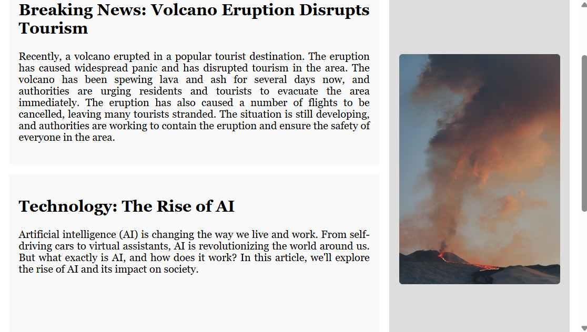
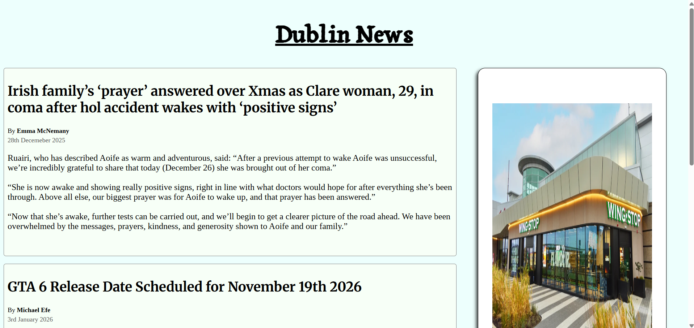
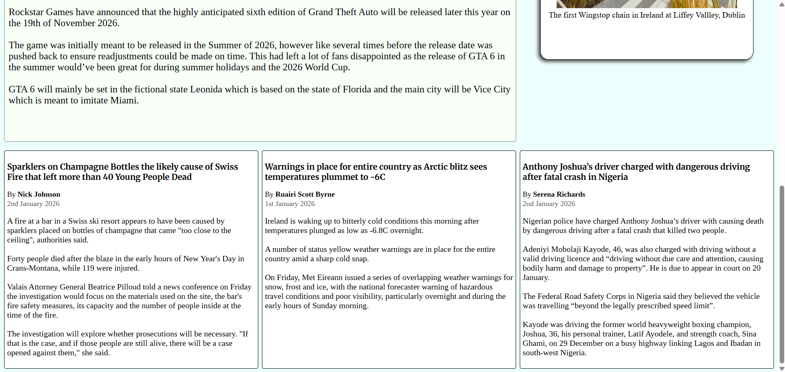

# [Live Demo](https://michaele490.github.io/FreeCodeCamp-Dublin-News/)

## Description

This lab was completed as part of FreeCodeCamp's Responsive Web Design certificate for its full stack development course. 
The lab is a part of the section which teaches CSS grid and reinforces the most important property-values in the grid layout technique. 
 
The goal for this web page was to create a web page with a newspaper layout which would be similar to the example given 
by FreeCodeCamp in the images below.

 

For this lab I chose to make a web page for a newspaper I called "Dublin News". Images of the web page are below. 

